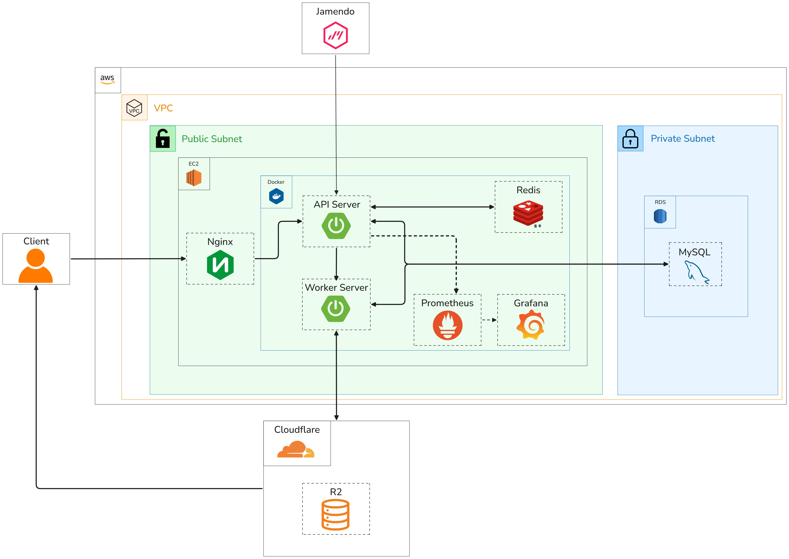
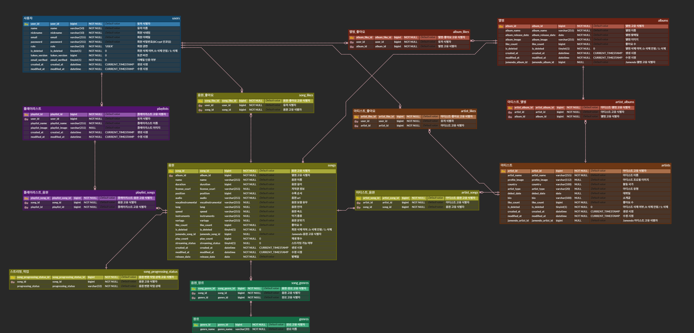

# 🍑 Peach Music

Peach Music은 인디 아티스트 중심의 음원 플랫폼으로,  
음원 스트리밍, 좋아요, 플레이리스트, 추천 및 인기 차트 기능을 제공합니다.

사용자 취향 기반 추천과 비동기 Worker 구조를 통해  
콘텐츠 처리와 스트리밍 성능을 고려한 시스템을 구현했습니다.

> 너의 취향에 Pitch를 맞추다, PeachMusic

---

# 🛠 기술 스택

**Language**

- Java 17

**Back-End**

- Spring Boot 3.5.9
- Spring Web
- Spring Data JPA
- QueryDSL
- Spring Validation
- Spring Security
- JWT
- BCrypt
- Lombok
- Spring Mail

**Database**

- MySQL
- Redis

**Storage**

- Cloudflare R2

**Infra**

- Docker
- AWS EC2
- AWS RDS

**Open API**

- Jamendo API

**Collaboration**

- Git
- GitHub
- ERDCloud
- Notion
- Slack
- Draw.io

**IDE**

- IntelliJ IDEA

**Test**

- Postman

---

# 🏗 시스템 구조

PeachMusic는 메인 서버와 Worker 서버를 분리하여 구성되어 있습니다.

**Main Server**

- 사용자 요청 처리
- 검색, 추천, 좋아요, 스트리밍 API 제공
- Worker 서버로 작업 요청 및 재시도 처리

**Worker Server**

- 음원 다운로드 처리
- 음원 트랜스코딩(형변환) 처리

Main Server는 Worker Server에 작업을 요청하고, Worker Server는 이를 비동기적으로 처리합니다.

Worker Repository:  
https://github.com/4realavenue/PeachMusic_Worker

---

## 전체 구조도



---

## ERD



---

# 🌐 배포 주소

https://peachmusics.com/

---

# 📁 디렉토리 구조

```text
src/main/java/com/example/peachmusic

├── common              # 공통 설정, 보안, 예외 처리, Redis, 파일 저장 등
│
├── domain              # 핵심 비즈니스 도메인
│   ├── user            # 회원 관리
│   ├── artist          # 아티스트 관리
│   ├── album           # 앨범 관리
│   ├── song            # 음원 관리, 스트리밍, 인기 차트
│   ├── playlist        # 플레이리스트
│   ├── search          # 검색 및 인기 검색어
│   ├── recommend       # 음원 추천 시스템
│   ├── openapi         # Jamendo API 연동 및 데이터 적재
│   ├── worker          # 음원 다운로드 재시도 및 트랜스코딩(형변환) 처리
│   └── like            # 좋아요 (artistLike, albumLike, songLike)

src/main/resources

├── static              # CSS, JS, 이미지
└── templates           # Thymeleaf HTML 템플릿

src/test/java/com/example/peachmusic

└── domain              # 서비스 및 추천/검색/동시성 테스트
```

---

# ✨ 주요 기능

## 유저

- CRUD 및 복구 (회원가입, 조회, 수정, 삭제(비활성화), 복구)
- 로그인 및 로그아웃
- 이메일 인증
- 좋아요한 아티스트, 앨범, 음원 조회

## 아티스트 / 앨범 / 음원

- CRUD 및 복구
- 이미지 및 음원 파일 업로드
- 좋아요 및 좋아요 취소
- 음원 스트리밍
- 인기 차트 Top100
- 취향 기반 추천

## 플레이리스트

- CRUD 및 복구
- 이미지 업로드
- 곡 추가 및 삭제

## 검색

- 통합 검색 (아티스트, 앨범, 음원)
- 카테고리별 검색
- 인기 검색어 조회

## 콘텐츠 및 시스템 처리

- 이미지 및 음원 파일 업로드 및 스트리밍
- Jamendo Open API 연동 및 데이터 적재
- Worker 기반 음원 다운로드 및 트랜스코딩 처리
- 메인 서버 – Worker 분리 구조

---

# 📄 API 명세

Notion API 문서

https://www.notion.so/teamsparta/S-A-2e62dc3ef51481139c7be0d4120c1511

---

# 🚧 트러블슈팅

## 대용량 음원 데이터 적재 성능 개선

Jamendo Open API를 통해 수집한 대량 음원 데이터를 저장하는 과정에서  
반복적인 DB 호출과 중복 조회로 인해 적재 시간이 크게 증가하는 문제가 발생했습니다.

이를 해결하기 위해

- JdbcTemplate Batch Insert 적용
- UNIQUE 제약 기반 중복 처리
- 불필요한 중복 조회 제거

를 통해 DB 접근 횟수를 줄이고 성능을 개선했습니다.

그 결과 음원 적재 시간을 약 50분에서 6분으로 단축했습니다.

---

## 검색 성능 개선

기존 LIKE 기반 검색은 Full Scan이 발생하여 성능이 저하되는 문제가 있었습니다.

이를 해결하기 위해

- MySQL FullText Index 적용
- Redis 캐싱 구조 적용

을 통해 검색 성능을 개선했습니다.

---

## Redis 기반 인기 차트 성능 개선

초기 인기 차트 구조에서는 Redis 조회 후 추가 DB 조회가 필요했습니다.

Redis Key 구조를 개선하여 Redis 조회만으로 응답이 가능하도록 개선했습니다.

---

## 좋아요 동시성 문제 해결

좋아요 테이블에는 UNIQUE 제약이 존재했지만,  
동시 요청 환경에서 예외 처리 안정성이 부족한 문제가 있었습니다.

INSERT 기반 처리 구조를 개선하고 동시성 테스트를 통해 검증하여  
안정적인 좋아요 처리가 가능하도록 개선했습니다.

---

# 💭 회고

대용량 데이터 처리, 캐싱, 검색 최적화, 비동기 처리 등  
실제 서비스 환경을 고려한 시스템 설계와 성능 개선을 경험할 수 있었습니다.

Worker 서버 분리, Redis 캐싱, FullText Index 적용 등을 통해  
확장성과 성능을 고려한 구조 설계의 중요성을 이해할 수 있었습니다.

---

# 👥 팀원 역할

### 김현수

- 음원 도메인 CRUD 구현
- 플레이리스트 도메인 CRUD 구현
- 음원 스트리밍 기능 구현
- 스토리지 연동 및 배포 환경 구성

### 권민서

- 통합 검색 및 도메인별 검색 기능 구현
- 인기 검색어 기능 구현
- Keyset Pagination 및 동적 정렬 적용
- 검색 성능 개선

### 신호준

- 유저 도메인 CRUD 및 복구 구현
- 인증 기능 구현 (회원가입, 로그인, 로그아웃, 이메일 인증)
- 음원 재생 횟수 저장 구현
- 인기 차트 조회 기능 구현

### 오은지

- 아티스트 및 앨범 도메인 CRUD 및 복구 구현
- 파일 업로드 기능 구현 (로컬 저장 방식)
- 좋아요 기능 구현 및 동시성 안정성 개선
- 사용자 좋아요 목록 조회 기능 구현
- 프론트엔드 UI 구현 및 백엔드 연동

### 최승희

- Jamendo Open API 연동 및 음원 데이터 수집
- 대용량 음원 데이터 적재 구조 설계 및 성능 개선
- 추천 시스템 설계 및 구현
- 프론트엔드 UI 구현 및 백엔드 연동

---

# 🚀 실행 방법

## 1. 프로젝트 클론

```bash
git clone https://github.com/4realavenue/PeachMusic.git
cd PeachMusic
```

---

## 2. 환경변수 설정

프로젝트 루트에 `.env` 파일을 생성합니다.

```bash
touch .env
```

`.env`

```env
DB_URL=jdbc:mysql://localhost:3306/peach_music
DB_USERNAME=your_db_username
DB_PASSWORD=your_db_password

REDIS_HOST=localhost
REDIS_PORT=6379

JWT_SECRET_KEY=your_jwt_secret_key

MAIL_HOST=smtp.gmail.com
MAIL_USERNAME=your_email@gmail.com
MAIL_PASSWORD=your_app_password

JAMENDO_API_BASE_URL=https://api.jamendo.com/v3.0
JAMENDO_CLIENT_ID=your_jamendo_client_id

WORKER_URL=http://localhost:8081

UPLOAD_PATH=./uploads
TRANSCODE_PATH=./transcoded

R2_ACCOUNT_ID=your_r2_account_id
R2_ACCESS_KEY_ID=your_r2_access_key_id
R2_SECRET_ACCESS_KEY=your_r2_secret_access_key

R2_BUCKET_ASSETS=your_assets_bucket
R2_BUCKET_MEDIA=your_media_bucket

ASSETS_PUBLIC_BASE=https://your_assets_public_url
STREAMING_BASE=https://your_streaming_public_url
```

---

## 3. 의존 서비스 실행

MySQL 실행 후 DB 생성

```sql
CREATE DATABASE peach_music;
```

생성한 peach_music 데이터베이스를 선택한 후,
프로젝트 루트 경로의 sql 폴더에 포함된 DDL 파일들을
파일명 순서대로 실행하여 테이블을 생성해주세요.

Redis 실행

```bash
redis-server
```

---

## 4. 서버 실행

```bash
./gradlew bootRun
```

또는 IntelliJ에서

```
PeachMusicApplication 실행
```

---

## 5. 접속

```
http://localhost:8080
```

Worker 서버 실행 방법은 Worker 프로젝트 README를 참고하세요.

---

## 🧪 테스트

```bash
./gradlew test
```
